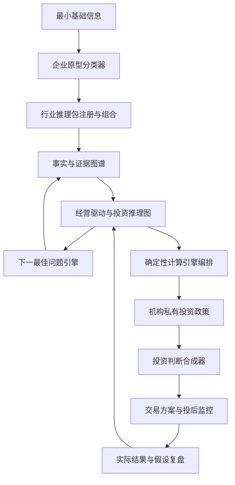

# 渐进式投资推理与行业推理包设计规格

**状态：** 已确认，供 DeepSeek 工程实施
**目标平台：** 现有投资尽调模型网站与代码库
**首个商业场景：** 成长期 PE/VC 股权投资
**首批行业包：** 企业软件/SaaS、消费品牌/连锁零售、先进制造/工业企业
**交付原则：** 增量扩展现有平台，不另建孤立产品，不以大模型自由生成替代确定性金融计算

---

## 1. 产品定位

本能力将现有投资尽调平台升级为“机构级投资推理与尽调决策平台”。客户只需提供少量但高价值的公司、业务和财务信息，系统即可：

1. 识别企业所属行业、商业模式和发展阶段；
2. 加载一个主行业推理包及必要的补充插件；
3. 构建事实、假设、推断和经营因果关系；
4. 调用现有预测、风险、估值、股权和决策引擎；
5. 形成经营、财务、竞争、护城河、团队、风险、融资、估值、退出、交易条款和投后监控的完整初判；
6. 找出最可能改变投资结论的信息缺口；
7. 每轮提出少量“下一最佳问题”；
8. 随新证据进入自动更新推理、置信度和投资判断。

产品不是通用 AI 报告生成器。正式结论必须由事实证据、版本化行业规则、确定性计算和机构投资政策共同产生。

## 2. 核心护城河

护城河不建立在单一大模型、通用提示词或行业平均投资判断上。核心专有资产为：

1. **投资推理图谱：** 描述经营指标、风险、融资、估值、退出和回报之间的因果传导；
2. **行业推理包：** 按行业、商业模式和阶段沉淀最小输入、指标定义、推理规则、风险、估值和交易逻辑；
3. **机构私有政策：** 将每家机构的收益要求、否决项、证据标准和投委会纪律转成可执行规则；
4. **假设—证据—结果账本：** 保存投前核心假设、当时证据、异议及投后验证结果；
5. **企业事实与证据图谱：** 持续保存来源、时间、口径、冲突和确认责任，而不是只保存最终报告；
6. **真实工作流锁定：** 将初筛、尽调、投委会、交割条件和投后监控连接成一条可审计链路。

跨机构不得汇总主观投资判断。未来可共享的仅限公共事实标准、数据源可靠性、文档异常模式、客观金融口径和债券/信贷类基准。

## 3. 范围

### 3.1 v1 范围

- 成长期股权投资；
- 机构私有化部署方向；
- 渐进式初判和动态追问；
- 三轴企业分类；
- 插件化行业推理包；
- 首批三个行业包；
- 复用现有七个确定性计算引擎；
- 机构投资政策；
- 推理卡片、置信度和稳定性；
- 投前假设转投后指标；
- 项目级审计与版本回放；
- 现有网站中的统一“智能初判”入口。

### 3.2 非目标

- v1 不同时开发银行授信版和券商 IPO/并购版；
- 不建设全功能基金行政管理、LP 管理或会计系统；
- 不使用大模型替代 DCF、IRR、MOIC、股权稀释等正式计算；
- 不将行业先验写成企业已确认事实；
- 不以行业平均判断覆盖机构自己的投资方法；
- 不要求首轮填写完整尽调问卷；
- 不承诺少量输入可以精确推断所有未知事实；
- 不允许无法追溯的 AI 结论进入正式投委会材料。

## 4. 现有平台集成原则

### 4.1 直接复用

现有平台已经具备以下能力，应继续复用而非重写：

- 公司信息搜索和 AI 研究；
- Excel、PDF、Word、PPT 资料提取；
- 证据候选、人工确认和冲突管理；
- 三情景预测引擎；
- 风险引擎；
- 估值三角验证及 LBO/QoE/Value Bridge；
- 股权、清算瀑布、IRR 和 MOIC；
- 投资决策引擎；
- 24 个分析模块；
- Word 报告和现有图表；
- DeepSeek、OpenAI、Ollama、Kimi 和自定义模型接口。

### 4.2 新增核心层

在现有模块之上增加“投资推理中枢”，至少包含：

- 企业原型分类器；
- 行业推理包注册表；
- 推理包组合解析器；
- 事实与推理图；
- 置信度计算器；
- 下一最佳问题引擎；
- 现有计算引擎编排器；
- 机构政策执行器；
- 投资判断合成器；
- 假设和投后监控桥接器；
- 推理版本与审计服务。

### 4.3 商业部署约束

当前纯前端、IndexedDB 和 localStorage 架构可保留为个人版、演示版和离线单机版，但机构团队私有化版本不能只依赖浏览器本地存储。

机构版本必须增加受控服务层，用于：

- 多用户、组织和权限；
- 服务器端模型网关及 API Key 管理；
- 项目数据库和文件存储；
- 审计日志；
- 机构政策版本；
- 备份、恢复和保留策略；
- SSO/企业身份；
- 内网部署与安全配置。

公开 Netlify 网站可继续作为演示和轻量版入口，但不得被视为银行、券商或机构私有化的最终安全架构。

## 5. 总体架构



## 6. 企业分类体系

分类不得只按行业。采用三轴分类：

```text
行业属性 × 商业模式 × 企业阶段
```

分类还应考虑：

- 资本密集度；
- 监管强度；
- 收入重复性；
- 客户结构；
- 产品标准化程度；
- 销售和交付模式；
- 地域和出海属性；
- 交易类型。

企业可组合多个包，例如：

```text
主包：企业软件 × SaaS × 成长期
补充包：大客户销售
风险包：数据合规
区域包：中国企业出海
交易包：少数股权投资
```

分类器必须输出候选原型、适配度、选择依据和需要确认的问题。适配度不足时使用通用成长企业包，并降低全部行业推断置信度。

## 7. 最小信息策略

### 7.1 通用首轮输入

首轮目标为约 8–12 项高价值信息：

- 公司名称；
- 行业和主要产品；
- 商业模式和收费方式；
- 当前发展阶段；
- 最近年度收入；
- 收入增速；
- 毛利率或主要成本结构；
- 现金余额或可支撑时间；
- 本轮融资金额；
- 当前估值；
- 投资机构策略；
- 可选的核心客户或订单信息。

### 7.2 “最少量”的定义

最少量不是固定字段数量，而是使新增信息对投资建议、估值区间或永久损失概率的边际影响低于机构阈值。

若 SaaS 企业缺失 NRR，即使已填写大量低价值字段，仍应继续追问；若六项核心数据已足够形成稳定判断，则不得要求填写完整长表。

## 8. 信息类型与溯源

系统内每个重要数据必须属于以下一种类型：

| 类型 | 含义 | 示例 |
| --- | --- | --- |
| 事实 | 有来源或人工确认的数据 | 审计报告收入 8,000 万元 |
| 计算 | 由确定性引擎产生 | 收入增速 60% |
| 推断 | 行业规则、先验和已知事实产生的区间 | 未来增速可能为 35%–45% |
| 判断 | 推断、计算和机构政策共同形成 | 当前价格缺乏安全边际 |
| 未知 | 缺少足够证据 | 前三大客户是否完成续约 |

每条记录至少保存：

- 稳定 ID；
- 项目和公司；
- 类型；
- 数值或文本；
- 单位和期间；
- 来源证据；
- 输入依赖；
- 使用的规则和行业包版本；
- 假设；
- 区间和置信度；
- 冲突状态；
- 创建时间和确认人；
- 可改变该结论的新信息。

## 9. 渐进式推理循环

```text
最小信息输入
→ 初步分类
→ 初步投资判断
→ 识别最大不确定性
→ 提出 3–5 个高价值问题
→ 客户补充数据或证据
→ 重跑相关推理节点和计算引擎
→ 展示结论变化原因
→ 继续追问或形成正式结论
```

每轮必须展示：

- 新增事实；
- 被替换的行业先验；
- 风险变化；
- 估值区间变化；
- 退出路径变化；
- 投资建议变化；
- 置信度变化；
- 本轮最有价值的新信息。

## 10. 下一最佳问题引擎

候选问题的优先级由以下原则计算：

```text
问题价值
= 改变投资结论的概率
× 对风险、估值或退出的影响
× 当前不确定程度
× 获得可靠答案的可能性
÷ 获取成本
```

每个问题必须包含：

- 问题内容；
- 为什么现在询问；
- 关联的推理节点；
- 可能影响的输出；
- 建议证据；
- 回答类型和单位；
- 预计信息价值；
- 是否为阻断性问题。

停止追问的条件：

- 判断置信度达到机构阈值；
- 剩余问题不会显著改变投资结论；
- 关键证据无法取得，正式标记信息不足；
- 触发不可覆盖的致命缺陷；
- 投资经理主动结束并提交投委会。

## 11. 行业推理包标准

每个行业推理包必须采用统一契约，至少包含：

1. 包 ID、版本和适用范围；
2. 匹配条件和不适用条件；
3. 最小高价值输入；
4. 指标定义、单位、期间和校验规则；
5. 经营驱动图；
6. 可推断变量；
7. 推断区间和置信度规则；
8. 下一最佳问题；
9. 风险传导链和致命缺陷；
10. 三情景预测配置；
11. 估值方法和可比筛选；
12. 融资、股权和稀释逻辑；
13. 退出路径；
14. 交易条款；
15. 投后监控指标；
16. 黄金案例和边界测试；
17. 版本迁移和兼容策略。

行业包只能通过标准接口调用核心引擎，不得复制风险、估值、股权或预测算法。

### 11.1 核心逻辑契约

以下契约用于固定模块边界。DeepSeek 可按现有代码规范拆分文件，但不得改变其业务语义。

```ts
type KnowledgeKind = 'fact' | 'calculation' | 'inference' | 'judgment' | 'unknown';
type ConfidenceBand = 'high' | 'medium' | 'low' | 'blocked';

interface ConfirmedFact {
  readonly factId: string;
  readonly metricId: string;
  readonly value: string | boolean;
  readonly unit: string | null;
  readonly period: string | null;
  readonly evidenceIds: readonly string[];
  readonly confirmedBy: string;
  readonly confirmedAt: string;
}

interface CandidateFact {
  readonly candidateId: string;
  readonly metricId: string;
  readonly proposedValue: string | boolean;
  readonly unit: string | null;
  readonly period: string | null;
  readonly sourceEvidenceIds: readonly string[];
  readonly modelRef: string | null;
  readonly confidence: ConfidenceBand;
}

interface InferenceSessionInput {
  readonly version: '1';
  readonly projectId: string;
  readonly institutionPolicyVersion: string;
  readonly asOfDate: string;
  readonly confirmedFacts: readonly ConfirmedFact[];
  readonly candidateFacts: readonly CandidateFact[];
  readonly requestedStrategy: 'growth_equity';
}

interface CompanyArchetypeResult {
  readonly primaryPackId: string;
  readonly supplementalPackIds: readonly string[];
  readonly matchScore: string;
  readonly classificationReasons: readonly string[];
  readonly confirmationQuestions: readonly string[];
  readonly fallbackUsed: boolean;
}

interface InferenceNode {
  readonly nodeId: string;
  readonly kind: KnowledgeKind;
  readonly metricId: string;
  readonly value: string | boolean | null;
  readonly lowerBound: string | null;
  readonly upperBound: string | null;
  readonly unit: string | null;
  readonly period: string | null;
  readonly confidence: ConfidenceBand;
  readonly sourceEvidenceIds: readonly string[];
  readonly dependencyNodeIds: readonly string[];
  readonly ruleIds: readonly string[];
  readonly assumptionIds: readonly string[];
  readonly conflictIds: readonly string[];
  readonly reversibleByQuestionIds: readonly string[];
}

interface NextBestQuestion {
  readonly questionId: string;
  readonly prompt: string;
  readonly reason: string;
  readonly expectedAnswerType: string;
  readonly unit: string | null;
  readonly requestedEvidenceTypes: readonly string[];
  readonly affectedNodeIds: readonly string[];
  readonly affectedOutputs: readonly ('risk' | 'forecast' | 'valuation' | 'financing' | 'exit' | 'decision')[];
  readonly informationValue: string;
  readonly blocking: boolean;
}

interface IndustryPackManifest {
  readonly packId: string;
  readonly version: string;
  readonly strategy: 'growth_equity';
  readonly supportedArchetypes: readonly string[];
  readonly requiredMetricIds: readonly string[];
  readonly optionalMetricIds: readonly string[];
  readonly ruleIds: readonly string[];
  readonly fatalFlawIds: readonly string[];
  readonly questionIds: readonly string[];
  readonly forecastProfileId: string;
  readonly valuationProfileIds: readonly string[];
  readonly exitProfileIds: readonly string[];
  readonly clauseProfileIds: readonly string[];
  readonly monitoringMetricIds: readonly string[];
  readonly goldenCaseIds: readonly string[];
}

interface InvestmentJudgmentOutput {
  readonly sessionId: string;
  readonly sessionVersion: number;
  readonly archetype: CompanyArchetypeResult;
  readonly investmentThesis: readonly InferenceNode[];
  readonly strongestCounterThesis: readonly InferenceNode[];
  readonly operatingAssessment: readonly InferenceNode[];
  readonly financialAssessment: readonly InferenceNode[];
  readonly competitiveAssessment: readonly InferenceNode[];
  readonly moatAssessment: readonly InferenceNode[];
  readonly teamAssessment: readonly InferenceNode[];
  readonly riskSnapshotRef: string | null;
  readonly forecastSnapshotRef: string | null;
  readonly valuationSnapshotRef: string | null;
  readonly equitySnapshotRef: string | null;
  readonly exitAssessment: readonly InferenceNode[];
  readonly transactionRecommendations: readonly InferenceNode[];
  readonly monitoringRecommendations: readonly InferenceNode[];
  readonly nextQuestions: readonly NextBestQuestion[];
  readonly overallConfidence: ConfidenceBand;
  readonly stability: 'stable' | 'sensitive' | 'unstable';
  readonly formalSubmissionBlocked: boolean;
  readonly blockingReasons: readonly string[];
  readonly traceId: string;
}
```

约束：

- 正式计算只通过快照引用进入判断输出，不复制计算结果来源；
- 所有 ID 在同一项目和版本内稳定；
- 所有小数沿用现有 Decimal 字符串和确定性排序约定；
- 输出必须可冻结、可序列化、可回放；
- 大模型原始文本不得直接成为 `fact`；
- `blocked` 置信度的节点不得支持正式投资建议；
- 行业包升级必须生成新会话版本，不静默覆盖旧判断。

## 12. 行业推理包完整输出链路

每个成熟行业包必须覆盖：

### 12.1 企业原型

- 商业模式；
- 当前阶段；
- 轻重资产；
- 监管和周期属性；
- 当前主要经营矛盾。

### 12.2 经营质量

- 增长来源和可持续性；
- 收入重复性；
- 规模化和经营杠杆；
- 交付可复制性；
- 增长与现金之间的关系。

### 12.3 收入质量

- 经常性与一次性收入；
- 客户、单价和并购贡献；
- 合同、开票和回款匹配；
- 提前确认、压货和关联交易风险；
- 下一年度收入区间。

### 12.4 单位经济

- 单客户、单订单、单店、单产线或单项目贡献；
- CAC、LTV、回收期；
- 单位毛利和盈亏平衡点；
- 规模扩大后的单位成本。

### 12.5 成本和利润

- 固定与变动成本；
- 毛利率驱动；
- 费用效率；
- 盈亏平衡时间；
- EBITDA 和净利润改善路径；
- 补贴和会计处理依赖。

### 12.6 现金和生存能力

- 现金消耗；
- 营运资金；
- 现金跑道；
- 最低安全现金；
- 融资窗口和融资金额；
- 融资延迟压力测试。

### 12.7 三情景预测

- 月度和年度收入；
- 毛利、EBITDA 和自由现金流；
- 现金耗尽时间；
- 融资需求；
- 每个情景的成立条件。

### 12.8 市场和竞争

- 市场空间区间；
- 当前渗透率；
- 行业集中度；
- 竞争位置；
- 增长来自行业扩张还是份额变化；
- 竞争变化触发因素。

### 12.9 护城河

- 切换成本；
- 网络效应；
- 数据；
- 技术和专利；
- 规模经济；
- 品牌；
- 渠道；
- 牌照；
- 供应链；
- 组织能力；
- 护城河能否转化为利润及是否已反映在价格中。

### 12.10 团队和组织

- 创始人与行业匹配；
- 阶段经验；
- 关键岗位缺口；
- 关键人依赖；
- 组织扩张能力；
- 股权稳定性。

### 12.11 风险

- 风险概率、影响和缓释；
- 风险传导链；
- 风险相互放大；
- 致命缺陷；
- 最坏情景；
- 永久损失概率和临时回撤概率。

### 12.12 融资和股权

- 合理融资额；
- 现金跑道；
- 本轮和后续稀释；
- ESOP 影响；
- 下一轮条件；
- 创始人和投资人持股；
- 清算优先权；
- MOIC、IRR 和最高可接受投前估值。

### 12.13 估值和价格纪律

- 适用估值方法；
- 合理估值区间；
- 当前报价隐含假设；
- 安全边际；
- 关键敏感变量；
- 建议投资价格上限。

### 12.14 退出

- IPO；
- 产业并购；
- 财务投资人接盘；
- 老股转让；
- 回购；
- 分红；
- 清算；
- 各路径适配度、期限、条件、概率、估值和回报。

### 12.15 交易与投后

- 建议投资金额；
- 建议持股；
- 分期投资；
- 先决条件；
- 保护性条款；
- 信息权和治理权；
- 投后关键指标；
- 预警阈值；
- 假设失效后的动作。

## 13. 首批行业包

### 13.1 企业软件与 SaaS

核心指标包括：ARR、MRR、收入增速、毛利率、NRR、GRR、客户数量、客单价、CAC、LTV、CAC 回收期、销售效率、客户集中度、合同期限、实施收入、现金消耗和 Rule of 40。

重点推理：

- 增长质量和收入重复性；
- 大客户续费风险；
- 获客效率和规模化；
- 现金跑道及下一轮融资；
- 收入倍数和 DCF；
- 产业并购与 IPO 适配度；
- 续约里程碑、分期投资和信息权。

### 13.2 消费品牌与连锁零售

核心指标包括：收入、毛利率、复购率、客单价、渠道结构、平台费用、获客成本、库存周转、退货率、门店数、同店增长、单店投资、单店回收期和现金转换周期。

重点推理：

- 品牌增长与促销增长区分；
- 渠道和平台依赖；
- 库存及营运资金；
- 单店经济模型；
- 扩店速度和现金压力；
- 品牌并购价值；
- 库存、渠道、预算和扩店条件。

### 13.3 先进制造与工业企业

核心指标包括：订单、在手订单、收入、产能、利用率、良率、单位成本、材料成本、客户集中度、回款周期、库存、资本开支、设备折旧、扩产计划和负债。

重点推理：

- 订单转收入；
- 产能和良率对毛利的影响；
- 周期、价格和原料风险；
- 扩产资金和营运资金；
- 客户认证和集中度；
- 产业并购和上市条件；
- 资本开支、订单和客户验证条件。

## 14. 置信度与稳定性

置信度不得由大模型自由声明。系统按以下因素计算：

```text
置信度
= 证据覆盖度
× 数据质量
× 行业包适配度
× 推理稳定性
× 历史校准度
```

每项重要输出必须提供推理卡片：

- 结论；
- 类型；
- 置信度；
- 支持事实；
- 推断过程；
- 计算结果；
- 关键假设；
- 敏感因素；
- 反方证据；
- 可改变结论的信息。

系统自动进行收入、毛利率、回款、融资时间和退出倍数扰动测试。若轻微变化即可改变投资建议，必须标记“结论稳定性低”。

## 15. 正式计算边界

以下内容必须由现有或新增的确定性引擎计算：

- 财务指标；
- 三情景预测；
- DCF、可比公司、VC 法和 LBO；
- 股权稀释和清算瀑布；
- IRR 和 MOIC；
- 现金跑道；
- 风险评分；
- 敏感性矩阵；
- 永久损失和临时回撤区间。

大模型仅可：

- 识别企业原型；
- 提取和归类事实；
- 提出假设和问题；
- 选择候选规则；
- 解释引擎结果；
- 形成正方、反方和待验证逻辑。

大模型不得自行补齐正式财务数字、覆盖红线、删除冲突或直接替代投委会签署。

## 16. 机构私有投资政策

机构可配置并版本化：

- 投资阶段和行业；
- 投资金额和持股范围；
- 目标 IRR/MOIC；
- 安全边际；
- 行业和单项目敞口；
- 风险容忍度；
- 否决项；
- 证据质量门槛；
- 投委会升级和签署规则；
- 条款偏好；
- 投后监控频率。

同一项目在不同机构中可以形成不同投资建议，但确认事实、计算结果和推理来源不得因机构偏好被改写。

## 17. 用户界面增量设计

### 17.1 智能初判入口

在现有项目仪表盘增加统一入口。首屏仅展示最小输入，不复制现有 24 个模块的完整表单。

### 17.2 初步投资判断

第一轮展示：

- 企业原型；
- 投资逻辑；
- 最强反方逻辑；
- 初步风险；
- 暂定估值区间；
- 暂定退出排序；
- 当前置信度；
- 关键未知；
- 下一批 3–5 个问题。

### 17.3 推理工作台

支持查看：

- 推理图；
- 推理卡片；
- 证据和冲突；
- 行业包和规则版本；
- 结论变化时间线；
- 正方与反方观点；
- 机构政策影响。

### 17.4 现有模块联动

智能初判生成的候选数据必须通过确认流程写入现有模块。现有模块的正式数据变化后，推理中枢自动重算相关节点，不得依靠人工复制。

### 17.5 投后监控

投前核心假设自动生成监控项、频率、黄线、红线和影响范围。实际值越界时重跑相关预测、风险、估值和退出结论。

## 18. 状态与生命周期

一个项目的推理生命周期至少包含：

```text
未分类
→ 初步分类
→ 初判可用
→ 等待关键信息
→ 正式尽调
→ 判断可提交
→ 投委会审议
→ 条件性批准/批准/拒绝
→ 交割条件跟踪
→ 投后监控
→ 退出/关闭
```

每次状态变化必须记录操作者、原因、输入快照和结论版本。

## 19. 错误与保守降级

- AI 不可用：确定性引擎和人工录入继续工作；
- 行业包不匹配：使用通用成长企业包并降低置信度；
- 数据不足：输出暂定初判和补件清单；
- 数据冲突：保留全部来源，降低置信度，必要时阻断；
- 关键证据缺失：不得形成对应正式事实；
- 引擎失败：保留输入、错误轨迹和未完成模块；
- 致命缺陷：允许继续整理事实，但阻断暗示可投资的正式结论；
- 规则升级：历史项目默认保留原版本，不静默重写历史结论；
- 模型输出解析失败：不得丢失已确认数据，不得使用部分损坏结果填充模块。

## 20. 权限、安全和模型治理

机构版本至少需要：

- 组织、团队、角色和项目权限；
- 字段级敏感信息控制；
- SSO；
- 数据库和文件加密；
- 私有模型或受控模型网关；
- API Key 服务器端集中管理；
- 模型、提示词和行业包白名单；
- 导出和下载审计；
- 数据保留、删除、备份和恢复；
- 客户可配置的日志保留周期；
- 输入输出脱敏；
- 外部网络访问控制；
- 推理版本可回放。

## 21. 商业产品结构

商业收费建议由以下部分组成：

```text
首次实施费
+ 年度平台许可
+ 团队或用户规模许可
+ 行业推理包许可
+ 专属行业包开发费
+ 年度维护和模型治理服务
```

首版重点销售场景：

1. 项目初筛；
2. 正式尽调；
3. 投委会材料和异议管理。

不以 Token 数量作为主要商业价值。销售价值应围绕决策效率、判断一致性、知识沉淀、审计能力和遗漏风险降低。

## 22. 银行与券商扩展边界

未来银行和券商版本复用：

- 企业事实和证据图谱；
- 渐进式推理；
- 行业推理包；
- 确定性计算；
- 权限、审计和模型治理。

新增政策包：

- 银行：偿债能力、授信额度、担保抵押和贷后预警；
- 券商：IPO/并购底稿、合规核查和披露一致性。

v1 不实现这些政策包，但核心数据与推理接口不得把 PE/VC 的主观判断写死为通用事实。

## 23. 测试与验收

### 23.1 黄金案例

每个行业包至少覆盖：

- 优质公司但价格过高；
- 经营一般但价格便宜；
- 表面增长良好但存在致命风险；
- 数据不足；
- 多来源冲突；
- 轻微参数变化导致结论翻转。

黄金案例锁定输入、推理节点、问题顺序、计算结果、风险、估值、退出、条款和投资建议。

### 23.2 稀疏输入

验证首轮少量输入时：

- 不编造事实；
- 正确选择行业包；
- 输出暂定区间；
- 明确未知；
- 提出高价值问题；
- 不产生虚假高置信度。

### 23.3 信息增量

逐步增加客户集中度、续费、现金消耗和合同证据，验证相关节点和结论自动更新，并解释变化原因。

### 23.4 冲突和异常

验证管理层、审计、税务、合同和公开信息冲突不会被静默覆盖。

### 23.5 反事实与敏感性

验证收入、毛利率、融资时间、客户流失和退出倍数变化能够稳定重算。

### 23.6 行业专家验收

每个行业包必须由具有真实项目经验的投资人员审核问题、指标、推理链、估值、风险、条款和投后指标。

### 23.7 首版验收指标

- 首轮输入约 8–12 项；
- 首轮形成完整但明确标注置信度的初判；
- 每轮提出 3–5 个高价值问题；
- 正式数字全部来自确定性引擎；
- 推断全部可追溯；
- 不支持的事实不得进入正式结论；
- 新信息触发依赖节点重算；
- 同一输入和版本产生可重复结果；
- 投资经理可质疑并覆盖判断，但覆盖必须有理由和审计；
- 最终输出覆盖经营至投后监控完整链路。

## 24. DeepSeek 实施阶段

### 阶段 1：通用投资推理框架

- 企业原型分类；
- 行业包注册与组合；
- 五类信息模型；
- 推理图；
- 置信度；
- 下一最佳问题；
- 引擎编排；
- 推理卡片；
- 统一输出契约。

### 阶段 2：SaaS 完整行业包

以 SaaS 包验证从少量输入到交易和投后的完整链路。

### 阶段 3：消费品牌与连锁行业包

验证渠道、库存、门店和复购逻辑。

### 阶段 4：先进制造与工业行业包

验证订单、产能、良率、资本开支和周期逻辑。

### 阶段 5：机构政策与私有化团队版

增加组织权限、投委会、审计、模型网关、备份和机构政策配置。

阶段之间必须以前一阶段黄金案例和全量回归通过为进入条件。不得同时并行开发三个浅层行业包。

## 25. 建议工程边界

建议在现有代码中增加职责清晰的模块，而不是继续把推理逻辑写入 React 页面或单一提示词文件：

```text
domain/inference/             推理节点、事实、假设、问题和置信度契约
engines/inference/            推理图、依赖重算、问题排序和判断合成
industry-packs/               行业包注册表及各行业包
institution-policy/           机构投资政策及版本
infrastructure/inference/     模型适配、持久化、审计和服务边界
features/inference/           智能初判、推理卡片、问题和变化时间线 UI
```

具体目录可按现有项目约定调整，但必须保持领域契约、纯推理引擎、基础设施和 UI 分离。

## 26. 完成定义

本能力完成时必须满足：

1. 现有平台功能保持可用；
2. 客户可从少量输入启动初判；
3. 系统按三轴选择并组合行业包；
4. 推理包覆盖经营到投后完整链路；
5. 系统主动提出高价值问题；
6. 事实、计算、推断、判断和未知严格分离；
7. 风险、估值、股权、预测和回报由确定性引擎产生；
8. 每个结论可追溯、可质疑、可被新证据推翻；
9. 机构政策与行业规则分离；
10. 首批三个行业包通过黄金案例和行业专家验收；
11. 投前核心假设能够转化为投后监控；
12. 机构商业版本具备受控服务层、权限、审计和模型治理；
13. 工程实现由 DeepSeek 团队完成，本规格不授权以简化提示词替代上述架构。
